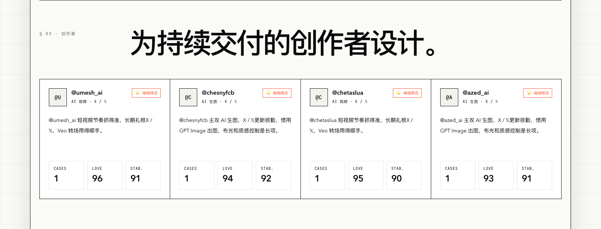

# GoodCase.ai

中文文档 | [README in English](./README_EN.md)

[](https://goodcase.ai)
[](https://github.com/LearnPrompt/goodcaseai)

官网：[goodcase.ai](https://goodcase.ai)

爆款案例的问题是刷过去就没了。你在 X 上看到一条惊艳的 AI 视频，点了个赞，三天后想复现，找不到提示词，不知道用了什么模型，也不知道作者还做过什么。

GoodCase.ai 把作品、作者、方法、原始来源与复测证据放回同一条 Case。完整 Prompt 公开，不要求注册账号。

**看清什么真有效，关注持续产出的人。**

## Showcase


## 一个对象，三个派生视图

**Case** 是入口。每条案例带完整提示词、模型组合和媒体素材，来自 X、小红书、B 站这些正在传播的现场。

**Creator** 把单条案例回挂到人。一条爆款可能只是运气，一个持续出好东西的创作者值得长期跟。

**Lab** 不是独立产品。复测记录、稳定分、漂移和成本都留在对应 Case 详情里。

**Skill** 只在多个 Case 反复成立后沉淀，本月不扩成独立页面或内容库。



## 本地运行

```bash
git clone https://github.com/LearnPrompt/goodcaseai.git
cd goodcaseai
npm ci
npm run dev
```

打开 http://localhost:3000 就能看到。

数据层用 Supabase。把 `.env.example` 复制成 `.env.local`，填入 Supabase 与站点 origin；表结构在 `supabase/schema.sql`。没配 Supabase 也能跑，页面会退回内置案例数据。

## 内容管道

自动发现与人工发布分开。影子供给只生成本地报告，不写数据库：

```bash
npm run supply:shadow
npm run supply:youmind
```

`supply:shadow` 读取 Radar 话题种子；`supply:youmind` 读取 YouMind 每周最热 Prompt 详情，并回溯原始 X 作者、原帖、媒体、公开 Prompt 和互动快照。两者都只写 `tmp/supply-reports`。YouMind 运行会额外生成 `*-case-candidates.json`，仍需人工审核后才能导入和发布。

人工确认后的候选按“导入 → 审核 → 发布”进入 Supabase：

```bash
npm run import:candidates -- --file=tmp/case-candidates.json
npm run review:candidates
npm run review:candidates -- --action=approve --id=<candidate-uuid> --note="原始来源与方法已核对" --evidence-level=L1 --tags=video,verified
# 或拒绝
npm run review:candidates -- --action=reject --id=<candidate-uuid> --note="无法确认作者或原始来源"
npm run publish:cases
```

审核只允许处理 `pending` 候选，并记录备注、证据级别和时间。候选导入和发布默认只追加，不覆盖已有审核记录或已发布 Case；发布中断后可凭 `source_candidate_id` 安全续跑。需要更新尚未绑定候选的同 slug Case 时，发布命令必须显式增加 `--allow-update`，已绑定其他候选的 Case 不允许改绑。

## 域名切换验收

备案通过并配置 DNS 后，运行只读验收：

```bash
npm run ops:domain-ready -- \
  --filing-approved \
  --wechat-real-device-passed \
  --stable-since=2026-07-26T00:00:00+08:00
```

命令会检查目标域名 DNS、TLS、关键页面、公开 API、RSS、sitemap、OG 图片与微信 UA HTTP；同时要求备案通过、微信真机验收和至少 24 小时稳定观察三项人工证据。任一门槛缺失都会以退出码 `2` 阻止迁站。开启旧域 301 后再用 `--phase=post-301` 验证路径和查询参数是否完整保留。

## 技术栈

Next.js App Router、Tailwind CSS、Supabase，部署在 Vercel。视觉上是单强调色、Swiss grid、零圆角和 1px 边框，克制到底。

## 致谢

GoodCase.ai 由 [卡尔](https://github.com/LearnPrompt) 维护。[LearnPrompt](https://www.learnprompt.pro) 只作为外部学习入口，不与 GoodCase 合并内容库。
