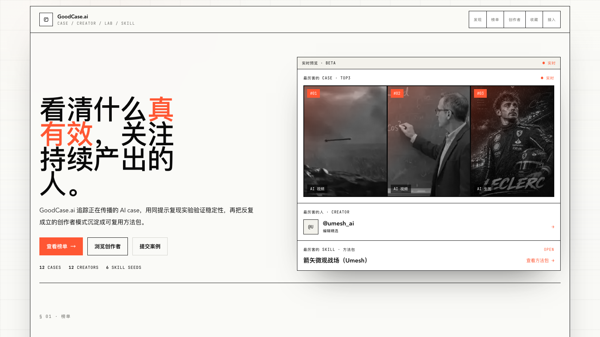
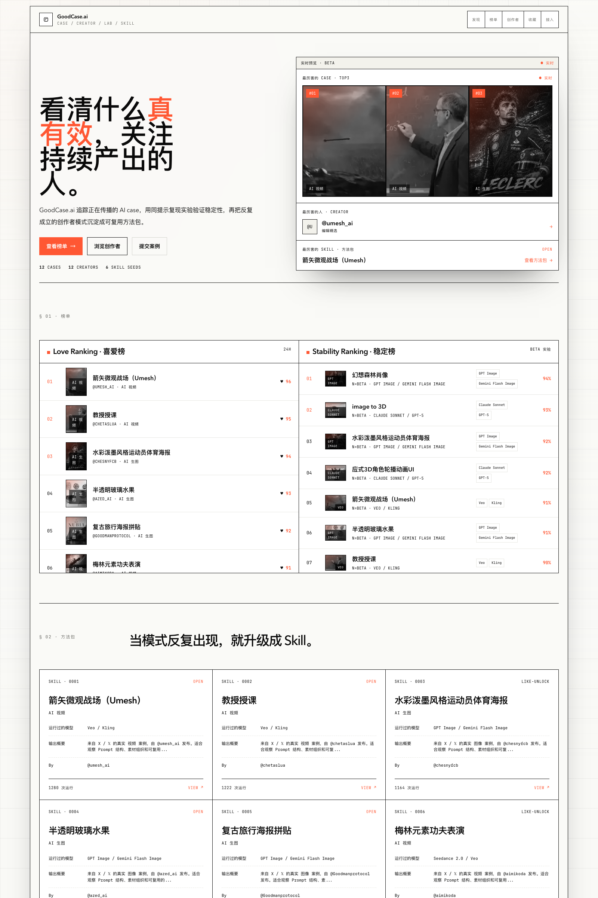

# GoodCase.ai

中文文档 | [README in English](./README_EN.md)

[](https://goodcase.ai)
[](https://github.com/LearnPrompt/goodcaseai)

官网：[goodcase.ai](https://goodcase.ai)

爆款案例的问题是刷过去就没了。你在 X 上看到一条惊艳的 AI 视频，点了个赞，三天后想复现，找不到提示词，不知道用了什么模型，也不知道作者还做过什么。

GoodCase.ai 把这件事接成一条完整的链路：追踪正在传播的 AI case，用同提示复现实验验证稳定性，看清谁在持续产出，再把反复成立的创作模式沉淀成可复用的方法包。

**看清什么真有效，关注持续产出的人。**

## Showcase





## 四层结构

**Case** 是入口。每条案例带完整提示词、模型组合和媒体素材，来自 X、小红书、B 站这些正在传播的现场。

**Creator** 把单条案例回挂到人。一条爆款可能只是运气，一个持续出好东西的创作者值得长期跟。

**Lab** 负责验证。同提示、同变量在不同模型上复跑，记录稳定分、漂移和成本。喜爱榜读人群偏好，稳定榜读模型稳定性。

**Skill** 是沉淀。当同一创作者反复跑出同类模式，它就升级成一个可以直接拿去用的方法包。

## 本地运行

```bash
git clone https://github.com/LearnPrompt/goodcaseai.git
cd goodcaseai
npm ci
npm run dev
```

打开 http://localhost:3000 就能看到。

数据层用 Supabase。把 `.env.example` 复制成 `.env.local` 填上三个变量，表结构在 `supabase/schema.sql`。没配 Supabase 也能跑：页面会自动退回内置的示例案例数据，适合先看看再决定要不要接库。

## 内容管道

飞书多维表当编辑后台，审核标为已采纳的案例由脚本同步进 Supabase：

```bash
node scripts/sync-feishu-cases.mjs --dry-run   # 预览
node scripts/sync-feishu-cases.mjs             # 正式同步
```

首页每 5 分钟增量再生成，同步脚本挂一个每天一次的 cron 就是全自动更新。

## 技术栈

Next.js App Router、Tailwind CSS、Supabase，部署在 Vercel。视觉上是单强调色、Swiss grid、零圆角和 1px 边框，克制到底。

## 致谢

GoodCase.ai 是 [LearnPrompt](https://www.learnprompt.pro) 生态的一部分，由 [卡尔](https://github.com/LearnPrompt) 维护。永远保持好奇。
